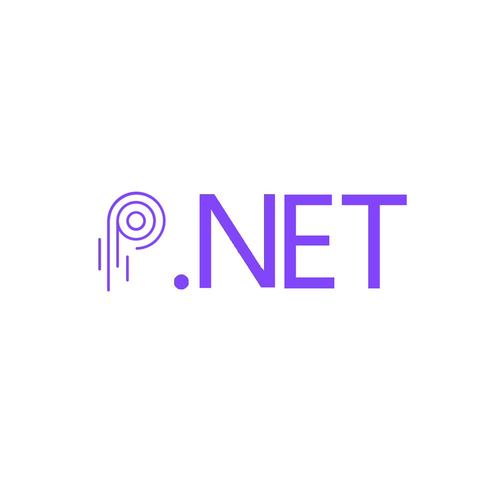

    

    
    
 
    
    
    
 
    
    
    

# What is Solnet.Pyth?

[Solnet](https://github.com/bmresearch/Solnet) is Solana's .NET integration library, a number of packages that implement features to interact with
Solana from .Net applications.

Solnet.Pyth is a package within the same `Solnet.` namespace that implements a Client for [Pyth](https://pyth.network/), this project is in a
separate repository so it is contained, as the goal for [Solnet](https://github.com/bmresearch/Solnet) was to be a core SDK.

## Features

- Decoding of Pyth data structures
- `PythClient` with methods that make it easy to get data and decode it
- Factory pattern for `PythClient`

## Requirements
- net 5.0

## Dependencies
- Solnet.Wallet v0.6.0
- Solnet.Rpc v0.6.0
- Solnet.Programs v0.6.0

## API

The `IPythClient` API follows the following structure:

### JSON RPC

###### `GetMappingAccountAsync(string account, Commitment commitment = Commitment.Finalized);`
  - Gets the given `MappingAccount`. This is an asynchronous operation.
###### `GetMappingAccount(string account, Commitment commitment = Commitment.Finalized);`
  - Gets the given `MappingAccount`.
###### `GetProductAccountAsync(string account, Commitment commitment = Commitment.Finalized);`
  - Gets the given `ProductAccount`. This is an asynchronous operation.
###### `GetProductAccount(string account, Commitment commitment = Commitment.Finalized);`
  - Gets the given `ProductAccount`.
###### `GetProductAccountsAsync(MappingAccount mappingAccount, Commitment commitment = Commitment.Finalized);`
  - Gets a list of `ProductAccount`s from the given `MappingAccount`. This is an asynchronous operation.
###### `GetProductAccounts(MappingAccount mappingAccount, Commitment commitment = Commitment.Finalized);`
  - Gets a list of `ProductAccount`s from the given `MappingAccount`.
###### `GetPriceDataAccountAsync(string account, Commitment commitment = Commitment.Finalized);`
  - Gets the given `PriceDataAccount`. This is an asynchronous operation.
###### `GetPriceDataAccount(string account, Commitment commitment = Commitment.Finalized);`
  - Gets the given `PriceDataAccount`.
###### `GetPriceDataAccountsAsync(List<ProductAccount> productAccounts, Commitment commitment = Commitment.Finalized);`
  - Gets a list of `PriceDataAccount`s from the given list of `ProductAccount`. This is an asynchronous operation.
###### `GetPriceDataAccounts(List<ProductAccount> productAccounts, Commitment commitment = Commitment.Finalized);`
  - Gets a list of `PriceDataAccount`s from the given list `ProductAccount`.
  
### Streaming JSON RPC

###### `SubscribePriceDataAccountAsync(Action<Subscription, PriceDataAccount, ulong> action, string priceAccountAddress, Commitment commitment = Commitment.Finalized);`
  - Subscribe to a live feed of a `PriceDataAccount`, the given action is called on every notification received. This is an asynchronous operation.
###### `SubscribePriceDataAccount(Action<Subscription, PriceDataAccount, ulong> action, string priceAccountAddress, Commitment commitment = Commitment.Finalized);`
  - Subscribe to a live feed of a `PriceDataAccount`, the given action is called on every notification received.
###### `UnsubscribePriceDataAccountAsync(string priceAccountAddress);`
  - Unsubscribe to a live feed of a `PriceDataAccount`. This is an asynchronous operation.
###### `UnsubscribePriceDataAccount(string priceAccountAddress);`
  - Unsubscribe to a live feed of a `PriceDataAccount`.

## Examples

The [Solnet.Pyth.Examples](https://github.com/bmresearch/Solnet.Pyth/tree/master/Solnet.Pyth.Examples) project features some examples on how to usethe [ISerumClient](https://github.com/bmresearch/Solnet.Pyth/tree/master/Solnet.Pyth/IPythClient.cs), these examples include:
- Streaming price data
- Retrieving data from the various accounts:
  - `MappingAccount`
  - `ProductAccount`
  - `PriceDataAccount`

## Contribution

We encourage everyone to contribute, submit issues, PRs, discuss. Every kind of help is welcome.

## Contributors

* **Hugo** - *Maintainer* - [murlokito](https://github.com/murlokito)

See also the list of [contributors](https://github.com/bmresearch/Solnet.Pyth/contributors) who participated in this project.

## License

This project is licensed under the MIT License - see the [LICENSE](https://github.com/bmresearch/Solnet.Pyth/blob/master/LICENSE) file for details
